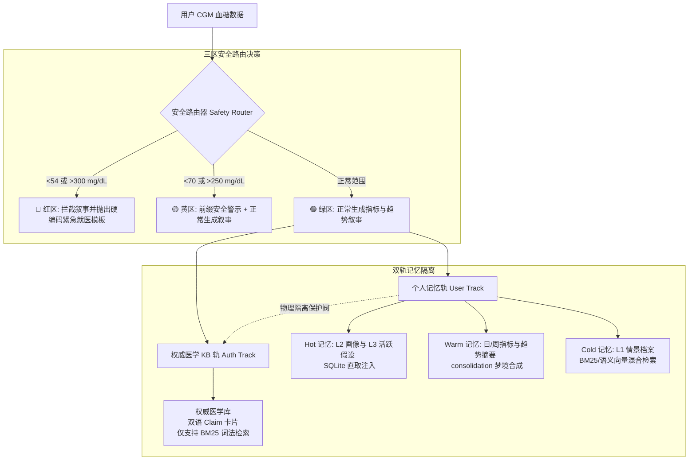

# Hermes CGM Agent

[](LICENSE)
[](pyproject.toml)
[](https://github.com/yichi2077/CGM-Agent)

基于 [Hermes Agent](https://github.com/yichi2077/hermes-agent) 构建的个人 Continuous Glucose Monitoring (CGM) 连续血糖监测 AI 智能体能力层。

---

## 🌟 核心理念：知情陪伴者 (The Informed Companion)

在循证医学的 **“共享决策 (Shared Decision-Making)”** 框架下，本项目智能体被定义为 **“知情陪伴者 (Informed Companion)”**（参见 [SOUL.md](file:///e:/字幕组测试/CGM-Agent/hermes-cgm-agent-latest/SOUL.md)）。它的定位不是医疗权威，也不是日常监督者，而是辅助用户回顾历史数据、发现个体规律的可靠盟友。

### 交互原则 ([SOUL.md](file:///e:/字幕组测试/CGM-Agent/hermes-cgm-agent-latest/SOUL.md) & [PRD-SUPPLEMENT.md](file:///e:/字幕组测试/CGM-Agent/hermes-cgm-agent-latest/PRD-SUPPLEMENT.md))
*   **先历史后知识 (History-First)**：当用户评估饮食或作息时，优先检索用户过去的个体经验，而非直接套用通用的医学理论。个体身体经验高于通用指南。
*   **非指令性 (Non-Directive)**：绝不代替用户做决定，杜绝命令式语气（避免使用 `你应该...`、`需要改善...`）。使用协作探讨语气（如 `我注意到...，要不要留意一下？`）。
*   **显式不确定性 (Explicit Uncertainty)**：对于个体规律永远使用缓和与不确定的语气（如 `可能...`、`似乎...`、`在你的记录中看起来...`），当数据不足时坦诚告知。
*   **无道德评判 (Non-Judgmental)**：复盘波动时仅客观呈现数据指标，不做对错评估。不给身体打分，不制造焦虑（严禁出现 `控制失败`、`控制得不好` 等评价）。
*   **协商式假设验证 (Collaborative Hypothesis Verification)**：将发现的规律视为有待共同验证的假设，运行生命周期状态机：`候选 (candidate)` ──> `观察中 (observing)` ──> `稳定 (stable)` ──> `失效/归档 (invalid)`。

---

## 🏗️ 架构设计

Hermes CGM Agent 能力层在数据、记忆层与安全网关之间建立了清晰、隔离的物理边界。



### 1. 三层记忆模型 ([docs/MEM-ARCH.md](file:///e:/字幕组测试/CGM-Agent/hermes-cgm-agent-latest/docs/MEM-ARCH.md))
*   **Hot（工作窗口记忆）**：近期血糖指标、用户画像（L2）与活跃假设（L3）直接从 SQLite 表中直取并拼接注入到 Prompt 上下文中，**不经过检索层**。
*   **Warm（状态合成记忆）**：通过 Consolidation 梦境合成服务（`consolidation.py`）在后台定期运行，将血糖时序指标与情景数据整合成结构化的日/周用户状态摘要，写入 `memory_summaries` 表，并在 prefetch 时注入。
*   **Cold（归档与检索记忆）**：历史血糖事件、L1情景情境档案以及医学知识库。按需检索，不主动注入。

### 2. 双轨 RAG 物理隔离 ([docs/adr/ADR-0001-memory-and-knowledge-architecture.md](file:///e:/字幕组测试/CGM-Agent/hermes-cgm-agent-latest/docs/adr/ADR-0001-memory-and-knowledge-architecture.md))
*   **权威医学知识轨 (Authoritative KB)**：存放经过临床核验/机器抽取的双语临床指标论断卡片（`ClaimCard`）。该库**只读**且使用 **BM25 纯词法分词检索**，通过 `tier`（优先 curated 卡）与匹配覆盖率避免机器生成的未核验卡片稀释高危指南。
*   **个人记忆检索轨 (User Memory)**：存放 L1情景档案（`l1_episodes`）。该库支持不对称检索策略，随着数据量增长，可从默认的 BM25 自动升级为可选的语义 dense 向量检索（如 `paraphrase-multilingual-MiniLM`）。
*   **双轨隔离守卫 (`memory_guard.py`)**：在执行层通过 `assert_track_isolation` 强校验，严禁个人叙事与医学权威信息混淆，防止交叉污染。

### 3. 三区安全路由器 ([src/hermes_cgm_agent/services/safety/router.py](file:///e:/字幕组测试/CGM-Agent/hermes-cgm-agent-latest/src/hermes_cgm_agent/services/safety/router.py))
在 LLM 叙事层前置对当前血糖时序数据进行分区拦截：
*   🟢 **绿区 (70–180 mg/dL)**：安全，正常进行生成与总结。
*   🟡 **黄区 (54–70 或 180–300 mg/dL)**：偏低/偏高，在正常消息前方添加加粗的 `⚠️ 提示前缀`，叙事不中断。
*   🔴 **红区 (<54 或 >300 mg/dL)**：**强硬编码拦截**。立刻截断并废弃 LLM 的叙事内容生成，直接返回固定的医疗警示信息，建议用户检查传感器或紧急就医。

### 4. L0 工作上下文压缩 ([src/hermes_cgm_agent/services/memory/l0_builder.py](file:///e:/字幕组测试/CGM-Agent/hermes-cgm-agent-latest/src/hermes_cgm_agent/services/memory/l0_builder.py))
为防止无界血糖时序爆掉 LLM 上下文，L0 构造器对 14 天的时序数据使用“渐进衰退”策略进行确定性压缩：
*   *近端（最近 3 天）*：保留完整点级数据。
*   *中端（第 4-7 天）*：压缩为小时均值、最大值和最小值。
*   *远端（第 8-14 天）*：仅保留日级聚合指标。
*   *关键事件*：用户标记的事件及异常检测到的血糖事件始终以高分辨率锚点形式保留。

### 5. 引用校验校验器 ([src/hermes_cgm_agent/services/safety/citation_guard.py](file:///e:/字幕组测试/CGM-Agent/hermes-cgm-agent-latest/src/hermes_cgm_agent/services/safety/citation_guard.py))
智能体提供了 `rag.verify_quotes` 运行期校验工具。在 Hermes 输送最终回复前，对生成文本内的每一个敏感医学数字与观点，与检索到的论断卡片进行 verbatim 字幕级精确对齐匹配，拦截任何未经证实的幻觉数字。

**报告管线硬门**（F3/D047）：在报告交付前，`builder.py` 强制以 `strict=True` 调用引用守卫，仅作用于外部生成的医学叙事（`medical_narrative`），不触及确定性指标段。未支撑数字直接阻断交付，返回"无法确认"persona 文案（`CITATION_BLOCK_TEMPLATE`）。

### 5b. 知识库临床签核工具 `kb.approve`
`kb.approve` 工具提供唯一受许可的 KB 写入路径：仅允许对 `tier=curated` 卡片执行签核，强制 `reviewer` provenance 字段，幂等且写回 KB JSON。`assert_kb_readonly` 守卫已收紧（denylist 新增 `approve`，仅通过显式 `allow_methods` 豁免），使任何未来新增写方法默认被拦截（净收紧原则 I）。

### 5c. 红区恢复二次确认
`SafetyRouter` 持有进程内状态 `_last_red_zone`，在红区事件后的 2 小时窗口内（可通过 `CGM_AGENT_RECOVERY_WINDOW_SECONDS` 环境变量覆盖），对后续评估自动比对存档原始红区与当前结果，并将 `recovery_check`（含 `recovery_confirmed` 指标）渲染进报告头。窗口到期自动清状态。

### 6. PHI 数据加密 ([src/hermes_cgm_agent/storage/sqlite.py](file:///e:/字幕组测试/CGM-Agent/hermes-cgm-agent-latest/src/hermes_cgm_agent/storage/sqlite.py))
SQLite 数据库文件落地在 Unix 系统下采用 `0600` 权限，对涉敏个人健康数据（PHI 字段如事件详情等）采用本地生成的 Fernet 秘钥（保存在库同级目录的 `storage.key` 中）进行应用端加密。

---

## 📂 项目目录结构

```text
├── src/hermes_cgm_agent/
│   ├── domain/               # 领域核心实体定义 (GlucosePoint, ClaimCard, MemoryCandidate 等)
│   ├── hermes_plugins/       # 本地 Hermes 安装注册插件辅助逻辑
│   ├── knowledge/            # 权威卡片库数据 (authoritative_kb.json), pdf 库以及 review 队列
│   ├── services/
│   │   ├── analytics/        # 确定性 CGM 指标 (TIR, GMI, CV) 以及低血糖事件计算算法
│   │   ├── data/             # 仓储读取层
│   │   ├── memory/           # L0 上下文拼装、 consolidation 梦境合成以及 USER.md 单向同步
│   │   ├── rag/              # 权威医学与个人 L1 混合检索模块
│   │   ├── safety/           # 三区路由器、引用校验以及双轨物理隔离守卫
│   │   └── tools/            # 面向 Hermes 的外部 Tool 路由分发器及入参校验
│   ├── storage/              # SQLite 读写与 Fernet 解密底层
│   └── cli.py                # 命令行 CLI 入口
├── integrations/             # 注册到 Hermes 主程序的插件 yaml 声明与 memory 适配器
│   ├── hermes/cgm/           # cgm 核心工具插件
│   └── hermes/cgm_memory/    # cgm 外部记忆 provider
├── tests/                    # 440+ 项严密的单元与集成测试套件
├── specs/                    # 分阶段功能实现规格蓝图 (Milestone 001 - 004)
└── docs/                     # ADR 架构决策日志、MEM-ARCH 规范文件等
```

---

## 🚀 安装与对接

### 准备工作
确保本地已安装 [Hermes Agent](https://github.com/yichi2077/hermes-agent)。本工具会自动寻找 Hermes 的 Home 主目录（一般为 `~/.hermes/` 或 Windows 的 `%LOCALAPPDATA%\hermes\`）。

### 1. 安装本包依赖
```bash
# 基础安装
pip install -e .

# 启用可选的语义向量检索支持
pip install -e ".[semantic]"
```

### 2. 一键安装插件到 Hermes
在工程根目录运行安装指令，会自动将插件 yaml 与软链接注册进 Hermes 内部：
```bash
# 查看即将进行的安装操作 (Dry Run)
python -m hermes_cgm_agent hermes-install --dry-run

# 执行正式安装
python -m hermes_cgm_agent hermes-install
```
*提示：在 Windows 平台下，请使用外部 Hermes 虚拟环境内的 python 解释器（例如 `%LOCALAPPDATA%\hermes\hermes-agent\venv\Scripts\python.exe`）来执行上述命令。*

---

## 🛠️ CLI 命令与开发工具集

### 状态查看与开发诊断
```bash
# 查看本地 Agent 与 sqlite 数据库加密密钥状态
python -m hermes_cgm_agent status
python -m hermes_cgm_agent dev-status

# 检查当前向 Hermes 暴露的工具列表
python -m hermes_cgm_agent tools

# 打印本地 Hermes 版本
python -m hermes_cgm_agent hermes-version
```

### 全链路导入仿真 (Seed Demo)
导入模拟的 14 天 CSV 时序点，自动触发低血糖事件检测、 consolidated L1/L2 记忆构建与画像生成：
```bash
# 在独立的测试数据库运行全链路仿真
python -m hermes_cgm_agent seed-demo --db-path .runtime/demo.db
```

### 医学指南 PDF 卡片提取导入 (Knowledge Pipeline)
```bash
# 触发 VLM 多模态或文本提取，从医学 PDF 生成待审核 ClaimCards
python -m hermes_cgm_agent kb-ingest-llm --pdf src/hermes_cgm_agent/knowledge/pdfs/battelino-2019-tir.pdf --out-dir src/hermes_cgm_agent/knowledge/review_queue --kb-version kb-2026-06-auto-v1 --mode auto

# 将审核队列中的卡片正式合入库中 (默认 verified=false)
python -m hermes_cgm_agent kb-merge --candidates src/hermes_cgm_agent/knowledge/review_queue/battelino-2019-tir.candidates.json

# 校验生产卡片库的 Schema 结构与规范
python -m hermes_cgm_agent kb-validate
```

### 指标合成与推送调度
```bash
# 手动触发周期策略（日/周/月报）生成检测
python -m hermes_cgm_agent push-tick --user-id user-1

# 手动合成指定时间窗口内的“梦境”状态摘要
python -m hermes_cgm_agent memory-synthesize --user-id user-1 --window-start 2026-05-31T00:00:00+00:00 --window-end 2026-06-01T00:00:00+00:00 --period daily
```

### 数据库路径合并迁移
将老旧本地开发数据库与密钥同步迁移合并到官方规范的 Hermes Home 存储路径下：
```bash
# 运行迁移试跑
python -m hermes_cgm_agent migrate-db --dry-run

# 执行正式合并迁移
python -m hermes_cgm_agent migrate-db
```

---

## 🧪 运行测试

本地集成了完整的单元测试发现。你可以随时运行以下命令，确保对代码的改动没有引起功能退化：

**Linux / macOS**:
```bash
PYTHONPATH=src python3 -m unittest discover -s tests
```

**Windows Powershell**:
```powershell
$env:PYTHONPATH="src"
python -m unittest discover -s tests
```

---

## 📄 关联规范文件

*   **最近审计与蓝图闭环进展**: [docs/STATUS-REPORT-2026-06-07.md](file:///e:/字幕组测试/CGM-Agent/hermes-cgm-agent-latest/docs/STATUS-REPORT-2026-06-07.md)
*   **架构决策演进**: [docs/DECISION_LOG.md](file:///e:/字幕组测试/CGM-Agent/hermes-cgm-agent-latest/docs/DECISION_LOG.md)
*   **记忆架构规范说明**: [docs/MEM-ARCH.md](file:///e:/字幕组测试/CGM-Agent/hermes-cgm-agent-latest/docs/MEM-ARCH.md)
