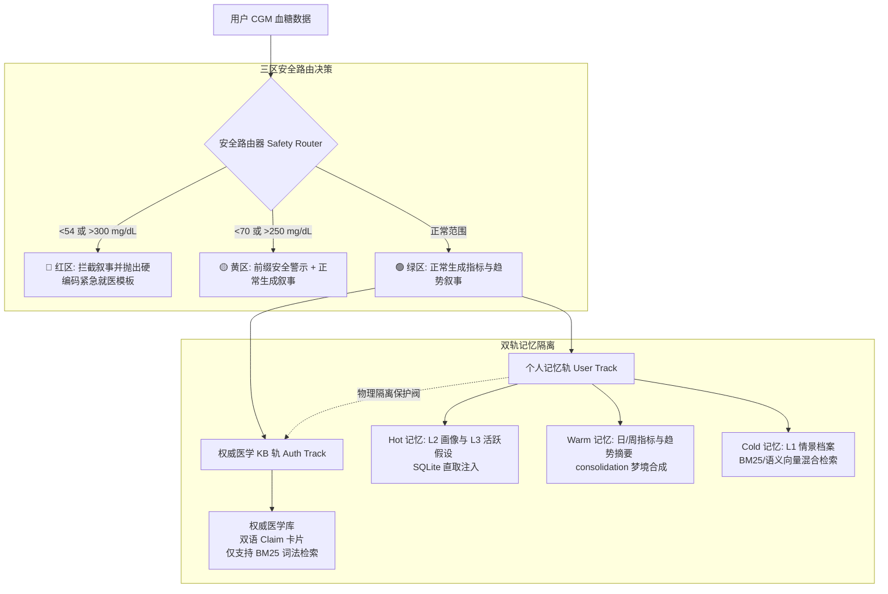

# Hermes CGM Agent

## Current Implementation Snapshot (2026-07-01)

- Hermes-facing tool count is 19 active tools, including realtime CGM snapshot reads.
- F2 production path (D064): **AiDEX X → vendor app → xDrip+ Companion mode → authenticated LAN HTTP bridge → canonical Hermes DB.** The project is an **AI enhancement layer over the vendor app**, not a replacement — the vendor app keeps the sensor BLE, live UI, and hypo/hyper alarms; xDrip captures its notifications. Companion capture is analysis-grade (~95% coverage), not an alarm channel. Juggluco direct-connect is the data-completeness fallback; Nightscout is the cross-network relay; vendor API was removed (D063, no entitlement).
- Production CLI: `bridge-status` and `bridge-poll`; deterministic continuous collection runs through the installed Hermes no-agent script `cgm_bridge_poll.py`.
- Default engineering fixture: `examples/cgm_test_dataset/cgm_14d_1min.csv` is a 14-day, single-user, native 1-minute prediabetes-style synthetic CGM dataset with behavior events and CGM artifacts.
- Storage now distinguishes `timestamp` as measured-at time from `received_at` collector receipt time.
- Deterministic detected glucose events persist in `detected_glucose_events`; `user_events` remains for user/agent-recorded events.
- Realtime signals include latest glucose, freshness, 15/30 minute deltas, 15 minute slope, 1 hour rolling mean, and missing-rate.
- Current local validation: `575 tests, OK (skipped=2)`（离线确定性套件；2 个 skip 为需 `CGM_RUN_HERMES_E2E=1` 显式开启的真实 LLM 端到端模块）.
- Known limitations for this release are tracked in [KNOWN_ISSUES.md](KNOWN_ISSUES.md).

[](LICENSE)
[](pyproject.toml)
[](https://github.com/yichi2077/CGM-Agent)

基于 [Hermes Agent](https://github.com/yichi2077/hermes-agent) 构建的个人 Continuous Glucose Monitoring (CGM) 连续血糖监测 AI 智能体能力层。

---

## 🌟 核心理念：知情陪伴者 (The Informed Companion)

在循证医学的 **“共享决策 (Shared Decision-Making)”** 框架下，本项目智能体被定义为 **“知情陪伴者 (Informed Companion)”**（参见 [SOUL.md](SOUL.md)）。它的定位不是医疗权威，也不是日常监督者，而是辅助用户回顾历史数据、发现个体规律的可靠盟友。

### 交互原则 ([SOUL.md](SOUL.md) & [PRD-SUPPLEMENT.md](PRD-SUPPLEMENT.md))
*   **先历史后知识 (History-First)**：当用户评估饮食或作息时，优先检索用户过去的个体经验，而非直接套用通用的医学理论。个体身体经验高于通用指南。
*   **非指令性 (Non-Directive)**：绝不代替用户做决定，杜绝命令式语气（避免使用 `你应该...`、`需要改善...`）。使用协作探讨语气（如 `我注意到...，要不要留意一下？`）。
*   **显式不确定性 (Explicit Uncertainty)**：对于个体规律永远使用缓和与不确定的语气（如 `可能...`、`似乎...`、`在你的记录中看起来...`），当数据不足时坦诚告知。
*   **无道德评判 (Non-Judgmental)**：复盘波动时仅客观呈现数据指标，不做对错评估。不给身体打分，不制造焦虑（严禁出现 `控制失败`、`控制得不好` 等评价）。
*   **协商式假设验证 (Collaborative Hypothesis Verification)**：将发现的规律视为有待共同验证的假设，运行生命周期状态机：`候选 (candidate)` ──> `观察中 (observing)` ──> `稳定 (stable)` ──> `失效/归档 (invalid)`。

---

## 🏗️ 架构设计

Hermes CGM Agent 能力层在数据、记忆层与安全网关之间建立了清晰、隔离的物理边界。


```mermaid
graph TD
    Data[用户 CGM 血糖数据] --> Router{安全路由器 Safety Router}
    
    subgraph "三区安全路由决策"
        Router -->|"<54 或 >300 mg/dL"| Red[🔴 红区: 拦截叙事并抛出硬编码紧急就医模板]
        Router -->|"<70 或 >250 mg/dL"| Yellow[🟡 黄区: 前缀安全警示 + 正常生成叙事]
        Router -->|正常范围| Green[🟢 绿区: 正常生成指标与趋势叙事]
    end

    subgraph "双轨记忆隔离"
        Green --> UserTrack[个人记忆轨 User Track]
        Green --> AuthTrack[权威医学 KB 轨 Auth Track]
        
        UserTrack --> Hot[Hot 记忆: L2 画像与 L3 活跃假设 <br> SQLite 直取注入]
        UserTrack --> Warm[Warm 记忆: 日/周指标与趋势摘要 <br> consolidation 梦境合成]
        UserTrack --> Cold[Cold 记忆: L1 情景档案 <br> BM25/语义向量混合检索]
        
        AuthTrack --> KB[权威医学库 <br> 双语 Claim 卡片 <br> 仅支持 BM25 词法检索]
        
        UserTrack -.->|物理隔离保护阀| AuthTrack
    end
```

### 1. 三层记忆模型 ([docs/MEM-ARCH.md](docs/MEM-ARCH.md))
*   **Hot（工作窗口记忆）**：近期血糖指标、用户画像（L2）与活跃假设（L3）直接从 SQLite 表中直取并拼接注入到 Prompt 上下文中，**不经过检索层**。
*   **Warm（状态合成记忆）**：通过 Consolidation 梦境合成服务（`consolidation.py`）在后台定期运行，将血糖时序指标与情景数据整合成结构化的日/周用户状态摘要，写入 `memory_summaries` 表，并在 prefetch 时注入。
*   **Cold（归档与检索记忆）**：历史血糖事件、L1情景情境档案以及医学知识库。按需检索，不主动注入。

### 2. 双轨 RAG 物理隔离 ([docs/adr/ADR-0001-memory-and-knowledge-architecture.md](docs/adr/ADR-0001-memory-and-knowledge-architecture.md))
*   **权威医学知识轨 (Authoritative KB)**：存放经过临床核验/机器抽取的双语临床指标论断卡片（`ClaimCard`）。该库**只读**且使用 **BM25 纯词法分词检索**，通过 `tier`（优先 curated 卡）与匹配覆盖率避免机器生成的未核验卡片稀释高危指南。
*   **个人记忆检索轨 (User Memory)**：存放 L1情景档案（`l1_episodes`）。该库支持不对称检索策略，随着数据量增长，可从默认的 BM25 自动升级为可选的语义 dense 向量检索（如 `paraphrase-multilingual-MiniLM`）。
*   **双轨隔离守卫 (`memory_guard.py`)**：在执行层通过 `assert_track_isolation` 强校验，严禁个人叙事与医学权威信息混淆，防止交叉污染。

### 3. 三区安全路由器 ([src/hermes_cgm_agent/services/safety/router.py](src/hermes_cgm_agent/services/safety/router.py))
在 LLM 叙事层前置对当前血糖时序数据进行分区拦截。阈值与代码常量一一对应（`RED_ZONE_LOW/HIGH = 54/300`、`YELLOW_ZONE_LOW/HIGH = 70/250`，均为严格不等式，恰好等于阈值的读数归上一级较安全区）：
*   🟢 **绿区 (70 ≤ 值 ≤ 250 mg/dL)**：安全，正常进行生成与总结。
*   🟡 **黄区 (54 ≤ 值 < 70 或 250 < 值 ≤ 300 mg/dL)**：偏低/偏高，在正常消息前方添加加粗的 `⚠️ 提示前缀`，叙事不中断。黄区上界取 250（Level 2 高血糖界）而非 TIR 上界 180——180–250 属于"目标范围外但非警示级"，由指标段客观呈现，不触发警示前缀。
*   🔴 **红区 (<54 或 >300 mg/dL)**：**强硬编码拦截**。立刻截断并废弃 LLM 的叙事内容生成，直接返回固定的医疗警示信息，建议用户检查传感器或紧急就医。红区事件后 2 小时内自动执行恢复复查（见 §5c）。

### 4. L0 工作上下文压缩 ([src/hermes_cgm_agent/services/memory/l0_builder.py](src/hermes_cgm_agent/services/memory/l0_builder.py))
为防止无界血糖时序爆掉 LLM 上下文，L0 构造器对 14 天的时序数据使用“渐进衰退”策略进行确定性压缩：
*   *近端（最近 3 天）*：保留完整点级数据。
*   *中端（第 4-7 天）*：压缩为小时均值、最大值和最小值。
*   *远端（第 8-14 天）*：仅保留日级聚合指标。
*   *关键事件*：用户标记的事件及异常检测到的血糖事件始终以高分辨率锚点形式保留。

### 5. 引用校验校验器 ([src/hermes_cgm_agent/services/safety/citation_guard.py](src/hermes_cgm_agent/services/safety/citation_guard.py))
智能体提供了 `rag.verify_quotes` 运行期校验工具。在 Hermes 输送最终回复前，对生成文本内的每一个敏感医学数字与观点，与检索到的论断卡片进行 verbatim 字幕级精确对齐匹配，拦截任何未经证实的幻觉数字。

**报告管线硬门**（F3/D047）：在报告交付前，`builder.py` 强制以 `strict=True` 调用引用守卫，仅作用于外部生成的医学叙事（`medical_narrative`），不触及确定性指标段。未支撑数字直接阻断交付，返回"无法确认"persona 文案（`CITATION_BLOCK_TEMPLATE`）。

### 5b. 知识库临床签核工具 `kb.approve`
Current implementation note (2026-07-08): `tier` records provenance
(`curated`/`auto`) and `verified` records clinician sign-off. The approval path
now accepts cards of any tier while still requiring `reviewer` provenance.
`kb-pending` lists unverified cards for review, and `kb-approve` is the CLI
wrapper around the same sanctioned write path as the Hermes `kb.approve` tool.

`kb.approve` 工具提供唯一受许可的 KB 写入路径：允许对任意 `tier` 卡片执行签核，强制 `reviewer` provenance 字段，幂等且写回 KB JSON；`tier` 只记录来源，`verified` 才记录临床签核状态。`assert_kb_readonly` 守卫已收紧（denylist 新增 `approve`，仅通过显式 `allow_methods` 豁免），使任何未来新增写方法默认被拦截（净收紧原则 I）。

> ⚠️ **当前版本知识库卡片全部尚未临床签核**（`verified=false`）：签核工具链已就绪，但尚无临床审核者完成签核。引用硬门保证叙事数字在卡片中有出处，不保证卡片抽取本身无误。详见 [KNOWN_ISSUES.md](KNOWN_ISSUES.md) 第 1 条。

### 5c. 红区恢复二次确认
`SafetyRouter` 持有进程内状态 `_last_red_zone`，在红区事件后的 2 小时窗口内（可通过 `CGM_AGENT_RECOVERY_WINDOW_SECONDS` 环境变量覆盖），对后续评估自动比对存档原始红区与当前结果，并将 `recovery_check`（含 `recovery_confirmed` 指标）渲染进报告头。窗口到期自动清状态。

### 6. PHI 数据加密 ([src/hermes_cgm_agent/storage/sqlite.py](src/hermes_cgm_agent/storage/sqlite.py))
SQLite 数据库文件（含 WAL 模式的 `-wal`/`-shm` 伴生文件）落地在 Unix 系统下采用 `0600` 权限，对涉敏个人健康数据（PHI 字段：血糖值、事件详情、报告全文、记忆各层等）采用本地生成的 Fernet 秘钥（保存在库同级目录的 `storage.key` 中）进行应用端加密。**`storage.key` 丢失则历史加密数据不可恢复——请与数据库文件一同备份。**

---

## 📂 项目目录结构

```text
├── src/hermes_cgm_agent/
│   ├── domain/               # 领域核心实体定义 (GlucosePoint, ClaimCard, MemoryCandidate 等)
│   ├── hermes_plugins/       # 本地 Hermes 安装注册插件辅助逻辑
│   ├── knowledge/            # 权威卡片库数据 (authoritative_kb.json), pdf 库以及 review 队列
│   ├── services/
│   │   ├── analytics/        # 确定性 CGM 指标 (TIR, GMI, CV) 以及低血糖事件计算算法
│   │   ├── data/             # 仓储读取层
│   │   ├── memory/           # L0 上下文拼装、 consolidation 梦境合成以及 USER.md 单向同步
│   │   ├── rag/              # 权威医学与个人 L1 混合检索模块
│   │   ├── safety/           # 三区路由器、引用校验以及双轨物理隔离守卫
│   │   └── tools/            # 面向 Hermes 的外部 Tool 路由分发器及入参校验
│   ├── storage/              # SQLite 读写与 Fernet 解密底层
│   └── cli.py                # 命令行 CLI 入口
├── integrations/             # 注册到 Hermes 主程序的插件 yaml 声明与 memory 适配器
│   ├── hermes/cgm/           # cgm 核心工具插件
│   └── hermes/cgm_memory/    # cgm 外部记忆 provider
├── tests/                    # 575 项单元与集成测试套件（离线基线，含 2 个 opt-in LLM e2e skip）
├── specs/                    # 分阶段功能实现规格蓝图 (Milestone 001 - 004)
└── docs/                     # ADR 架构决策日志、MEM-ARCH 规范文件等
```

---

## 🚀 安装与对接

### 准备工作
确保本地已安装 [Hermes Agent](https://github.com/yichi2077/hermes-agent)。本工具会自动寻找 Hermes 的 Home 主目录（一般为 `~/.hermes/` 或 Windows 的 `%LOCALAPPDATA%\hermes\`）。

### 1. 安装本包依赖
```bash
# 基础安装
pip install -e .

# 启用可选的语义向量检索支持
pip install -e ".[semantic]"
```

### 2. 一键安装插件到 Hermes
在工程根目录运行安装指令，会自动将插件 yaml 与软链接注册进 Hermes 内部：
```bash
# 查看即将进行的安装操作 (Dry Run)
python -m hermes_cgm_agent hermes-install --dry-run

# 执行正式安装
python -m hermes_cgm_agent hermes-install
```
*提示：在 Windows 平台下，请使用外部 Hermes 虚拟环境内的 python 解释器（例如 `%LOCALAPPDATA%\hermes\hermes-agent\venv\Scripts\python.exe`）来执行上述命令。*

### 3. 部署配置（环境变量一览）

单用户个人部署的全部可配置项，按功能分组。除标注"必需/建议设置"外均有安全默认值，可不配置。完整模板见仓库根目录 [.env.example](.env.example)。

#### 核心配置

| 环境变量 | 用途 | 默认值 | 必需 | 示例 |
|---|---|---|---|---|
| `CGM_AGENT_USER_ID` | 部署的唯一用户身份；记忆 provider、工具调用缺省 user_id、CLI 默认值统一走这里（D052） | `demo-user` | 建议设置 | `alice` |
| `CGM_AGENT_DISPLAY_UNIT` | 用户可见文本的血糖单位；设为 `mmol/L` 后状态摘要与本人/家属版报告以 mmol/L 呈现，存储与医生版保持 mg/dL | `mg/dL` | 否 | `mmol/L` |
| `CGM_AGENT_TIMEZONE` | 报告与调度使用的时区（IANA 名称） | `Asia/Shanghai` | 否 | `Asia/Shanghai` |
| `CGM_AGENT_DB_PATH` | SQLite 数据库路径显式覆盖；CLI 与插件共用同一解析器防裂脑 | Hermes 主目录 `cgm-agent/app.db` | 否 | `D:\data\cgm\app.db` |
| `CGM_AGENT_TIMEOUT_SECONDS` | 工具执行超时秒数 | `300` | 否 | `600` |
| `CGM_AGENT_MODEL` | Hermes 会话默认模型覆盖 | 无（用 Hermes 默认） | 否 | `deepseek-chat` |
| `CGM_AGENT_PROVIDER` | Hermes 会话默认 provider 覆盖 | 无 | 否 | `deepseek` |
| `CGM_AGENT_TOOLSETS` | Hermes 会话默认工具集覆盖（逗号分隔） | 无 | 否 | `cgm` |
| `CGM_AGENT_SKILLS` | Hermes 会话默认技能覆盖（逗号分隔） | 无 | 否 | `cgm-companion` |
| `CGM_AGENT_PROJECT_ROOT` | 插件安装时的工程根目录覆盖（`hermes-install` 用） | 自动探测 | 否 | `E:\CGM-Agent` |
| `HERMES_HOME` | Hermes 主目录覆盖；影响 DB 路径解析与插件安装位置 | `~/.hermes/` 或 `%LOCALAPPDATA%\hermes\` | 否 | `D:\hermes` |
| `HERMES_BIN` | Hermes 可执行文件路径覆盖 | 自动探测 | 否 | `D:\hermes\bin\hermes.exe` |
| `LOCALAPPDATA` / `USERNAME` | Windows 系统变量，用于默认路径与 WAL 伴生文件属主判断 | 系统提供 | 系统提供 | — |

#### 安全与加密

| 环境变量 | 用途 | 默认值 | 必需 | 示例 |
|---|---|---|---|---|
| `CGM_AGENT_STORAGE_KEY_PATH` | Fernet 加密密钥文件路径 | DB 同目录 `storage.key` | 否 | `D:\secrets\storage.key` |
| `CGM_AGENT_STORAGE_KEY` | Fernet 密钥内容直接注入（优先级高于文件） | 无 | 否 | `<base64-fernet-key>` |
| `CGM_AGENT_RECOVERY_WINDOW_SECONDS` | 红区恢复复查窗口秒数（见 §5c） | `7200`（2 小时） | 否 | `3600` |

> **⚠️ 安全提示**：密钥必须与 DB 同迁移，**密钥丢失则历史加密数据不可恢复，请与 DB 一同备份**。切勿将 `CGM_AGENT_STORAGE_KEY`、`CGM_BRIDGE_API_SECRET`、`CGM_SMTP_PASSWORD` 写入版本库或共享配置。

#### RAG / 知识库

| 环境变量 | 用途 | 默认值 | 必需 | 示例 |
|---|---|---|---|---|
| `CGM_AGENT_KB_PATH` | 权威 KB JSON 路径覆盖 | 包内 `knowledge/authoritative_kb.json` | 否 | `D:\kb\authoritative_kb.json` |
| `CGM_AGENT_KB_MIN_UNTRUSTED_OVERLAP` | 未核验（auto tier）卡片进入检索结果所需最小词法覆盖 | `1` | 否 | `2` |

#### 语义检索（可选，需 `pip install -e ".[semantic]"`）

| 环境变量 | 用途 | 默认值 | 必需 | 示例 |
|---|---|---|---|---|
| `CGM_AGENT_EMBED_MODEL` | 个人记忆轨 dense 向量模型 | `paraphrase-multilingual-MiniLM-L12-v2` | 否 | 同左 |
| `CGM_AGENT_RERANK_MODEL` | 检索重排 cross-encoder 模型 | `cross-encoder/ms-marco-MiniLM-L-6-v2` | 否 | 同左 |
| `CGM_AGENT_PERSONAL_SEMANTIC_MIN_EPISODES` | 个人轨从 BM25 升级为语义检索所需最少 L1 情景数 | `200` | 否 | `100` |
| `CGM_AGENT_ENABLE_SEMANTIC_RETRIEVAL` | 显式开启语义检索（`1/true/yes/on`） | 关闭 | 否 | `1` |
| `CGM_AGENT_USE_HASHING_EMBEDDER` | 使用离线 hashing embedder（测试/无网环境） | 关闭 | 否 | `1` |

#### 安卓 CGM 桥（唯一真实数据源）

| 环境变量 | 用途 | 默认值 | 必需 | 示例 |
|---|---|---|---|---|
| `CGM_BRIDGE_KIND` | 桥类型：`juggluco`（局域网直连）/ `xdrip` / `nightscout`（跨网中继） | 无 | 是 | `juggluco` |
| `CGM_BRIDGE_URL` | 手机 web server 或 Nightscout 实例地址 | 无 | 是 | `http://192.168.1.25:17580` |
| `CGM_BRIDGE_API_SECRET` | Juggluco/Nightscout API secret（**保密**；仅发送 SHA-1 header） | 无 | 二选一 | `<secret>` |
| `CGM_BRIDGE_ACCESS_TOKEN` | Nightscout 只读 reader token（跨网中继时使用） | 无 | 二选一 | `<reader-token>` |
| `CGM_BRIDGE_SOURCE` | 数据源标签 | 无 | 是 | `android:juggluco` |
| `CGM_BRIDGE_COUNT` | 每次拉取的读数条数 | `48` | 否 | `96` |
| `CGM_BRIDGE_EXPECTED_INTERVAL_MINUTES` | 期望采样间隔（分钟） | `5` | 否 | `1` |
| `CGM_BRIDGE_MAX_STALE_MINUTES` | 最新读数允许的最大陈旧度 | `12` | 否 | `15` |

#### HTTP 数据源桥

| 环境变量 | 用途 | 默认值 | 必需 | 示例 |
|---|---|---|---|---|
| `CGM_SOURCE_ALLOW_INSECURE_HTTP` | 允许公网明文 HTTP 数据源（**仅测试，生产勿开**；本地/私网 HTTP 默认即可用） | 关闭 | 否 | `true` |

#### SMTP / 推送投递（可选）

| 环境变量 | 用途 | 默认值 | 必需 | 示例 |
|---|---|---|---|---|
| `CGM_WEBHOOK_URL` | 推送投递 webhook 端点；配置后 `push_tick` 同一 tick 内自动投递（HTTPS-only、禁重定向、PHI 白名单过滤，见 D048/D053） | 未配置=不投递 | 否 | `https://hooks.example/cgm` |
| `CGM_SMTP_HOST` | SMTP 服务器；与 `CGM_SMTP_TO_ADDRESS` 同时配置后即真实发信 | 未配置=保持 queued | 否 | `smtp.gmail.com` |
| `CGM_SMTP_TO_ADDRESS` | 收件地址 | 无 | 用 Email 时必需 | `me@example.com` |
| `CGM_SMTP_PORT` | SMTP 端口 | `587` | 否 | `465` |
| `CGM_SMTP_USERNAME` | SMTP 登录用户名 | 无 | 视服务器 | `me@example.com` |
| `CGM_SMTP_PASSWORD` | SMTP 登录密码（**保密**） | 无 | 视服务器 | `<app-password>` |
| `CGM_SMTP_FROM_ADDRESS` | 发件地址 | username 或 `cgm-agent@localhost` | 否 | `cgm@example.com` |
| `CGM_SMTP_USE_TLS` | 启用 STARTTLS（`0/false/no` 关闭） | `1` | 否 | `1` |

Email 通道未经生产长期验证，webhook 仍是首选远程通道。

#### 开发 / 测试专用

| 环境变量 | 用途 | 默认值 | 必需 | 示例 |
|---|---|---|---|---|
| `CGM_RUN_HERMES_E2E` | 开启真实 Hermes+LLM 端到端测试（产生真实 API 费用） | 关闭 | 否 | `1` |
| `CGM_HERMES_REPO` | 仿真管线使用的 hermes-agent 仓库路径覆盖 | `%LOCALAPPDATA%` 下探测 | 否 | `D:\hermes-agent` |

---

## 🛠️ CLI 命令与开发工具集

### 状态查看与开发诊断
```bash
# 查看本地 Agent 与 sqlite 数据库加密密钥状态
python -m hermes_cgm_agent status
python -m hermes_cgm_agent dev-status

# 检查当前向 Hermes 暴露的工具列表
python -m hermes_cgm_agent tools

# 打印本地 Hermes 版本
python -m hermes_cgm_agent hermes-version
```

### Hermes local acceptance (`hermes-accept`)

`hermes-accept` runs a protected 24/48/72-hour accelerated replay against the
canonical synthetic database. It creates retrieval/rebuild copies plus a
manifest, timeline, redacted public scenario results, sidecar links, and a
machine-readable final report. The run checks L0-L3/Warm memory, pending
conversation candidates, authoritative RAG quote safety, 24 model scenarios,
periodic reports/push idempotency, and same-database replay. A real-model run
stops immediately on provider or tool-loading failure; it never silently
switches models.

```powershell
$env:PYTHONPATH='src'
python -m hermes_cgm_agent.cli hermes-accept `
  --source-db "$env:LOCALAPPDATA\hermes\cgm-agent\app.db" `
  --user-id demo-prediabetes-14d-v2 `
  --duration-hours 72 `
  --provider custom:<configured-provider> `
  --model gpt-5.5 `
  --max-model-calls 30 `
  --max-external-messages 6
```

`--no-model` is a deterministic smoke only. `--activate-on-pass` is required
for the guarded default-profile cutover; it backs up config, environment,
cron jobs, database, and storage key, activates `cgm_memory`, installs the
Windows Python watchdog/health jobs, verifies a default conversation, and
restores every backup automatically if any hard gate fails. External delivery
also requires `--send-external`, an existing Weixin target, the
`[CGM模拟验收]` prefix, and remains capped at six messages.

With external delivery enabled, the cutover runs the three oracle-date jobs
and up to two oracle-event jobs immediately via `hermes cron run`; the sixth
slot is reserved for the default-profile canary. Any failed execution or
delivery causes automatic rollback.

设计与硬门详见 [`docs/HERMES-ACCEPTANCE.md`](docs/HERMES-ACCEPTANCE.md)。

### 全链路导入仿真 (Seed Demo)
导入模拟的 14 天 CSV 时序点，自动触发低血糖事件检测、 consolidated L1/L2 记忆构建与画像生成：
```bash
# 在独立的测试数据库运行全链路仿真
python -m hermes_cgm_agent seed-demo --db-path .runtime/demo.db
```

### Realtime CGM Source Polling (F2)
The production path does not require MicroTech API access and preserves the
vendor app (D064):

```text
AiDEX X sensor → vendor app (BLE + alarms, unchanged)
              → system notifications → xDrip+ Companion mode (no BLE)
              → authenticated xDrip web service on the home LAN
              → bridge-poll → canonical SQLite → events/memory → Hermes tools
```

Configure the active Hermes `.env` (macOS/Linux `~/.hermes/.env`, Windows
`%LOCALAPPDATA%\hermes\.env`):

```bash
export CGM_AGENT_USER_ID='user-1'
export CGM_BRIDGE_KIND='xdrip'
export CGM_BRIDGE_URL='http://192.168.1.25:17580'
export CGM_BRIDGE_API_SECRET='<xdrip-web-service-secret>'
export CGM_BRIDGE_SOURCE='android:xdrip-companion'
export CGM_BRIDGE_EXPECTED_INTERVAL_MINUTES='1'
export CGM_BRIDGE_MAX_STALE_MINUTES='20'
python -m hermes_cgm_agent bridge-status
python -m hermes_cgm_agent bridge-poll
```

`bridge-status` performs a read-only live probe and reports newest-reading age,
staleness, clock skew, parsing issues, authentication mode and cron installation.
`bridge-poll` archives raw rows, deduplicates normalized points, detects events,
updates memory and writes a credential-free audit record. The client retries
transient failures and never returns the API secret/token in URLs or logs.

After the live probe passes, register the installed `cgm_bridge_poll.py` as a
one-minute Hermes `--no-agent` cron job. No LLM call or model cost is involved.
Companion capture is analysis-grade (~95% coverage), not an alarm channel — the
vendor app remains the alarm authority. Set `CGM_WEBHOOK_URL` to enable the
freshness watchdog (a PHI-free alert on a healthy↔stale boundary crossing, so a
silent overnight stall is announced). Detailed phone setup, watchdog, fallbacks
(Juggluco direct-connect / Nightscout relay / iOS) are in
[`docs/ANDROID-CGM-BRIDGE.md`](docs/ANDROID-CGM-BRIDGE.md).

The older manual collector remains available for diagnostics:

```powershell
python examples/cgm_test_dataset/virtual_cgm_feed.py --emit-interval-min 5
python -m hermes_cgm_agent source-poll --user-id user-1 --kind xdrip --url http://127.0.0.1:17580 --count 1 --expected-interval-min 5
python -m hermes_cgm_agent source-poll --user-id user-1 --kind nightscout --url https://nightscout.example --count 24
```

Plain HTTP is accepted only for localhost/private hosts by default. Public HTTP requires an explicit test override:

```powershell
$env:CGM_SOURCE_ALLOW_INSECURE_HTTP='true'
```

The official MicroTech/Dexcom vendor-API adapters were removed (2026-07-14):
this deployment has no API entitlement, so the Android bridge above is the
only real CGM data path.

### 医学指南 PDF 卡片提取导入 (Knowledge Pipeline)
```bash
# 触发 VLM 多模态或文本提取，从医学 PDF 生成待审核 ClaimCards
python -m hermes_cgm_agent kb-ingest-llm --pdf src/hermes_cgm_agent/knowledge/pdfs/battelino-2019-tir.pdf --out-dir src/hermes_cgm_agent/knowledge/review_queue --kb-version kb-2026-06-auto-v1 --mode auto

# 将审核队列中的卡片正式合入库中 (默认 verified=false)
python -m hermes_cgm_agent kb-merge --candidates src/hermes_cgm_agent/knowledge/review_queue/battelino-2019-tir.candidates.json

# 校验生产卡片库的 Schema 结构与规范
python -m hermes_cgm_agent kb-validate

# 列出待临床签核卡片；仅输出 id/title/tier/source/page，不输出卡正文
python -m hermes_cgm_agent kb-pending --format json --limit 20

# 医生签核任意来源层级的卡片；tier 保留为来源，verified 才是签核状态
python -m hermes_cgm_agent kb-approve --card-id <card-id> --reviewer <doctor-id>
```

### 指标合成与推送调度
```bash
# 手动触发周期策略（日/周/月报）生成检测
python -m hermes_cgm_agent push-tick --user-id user-1

# 手动合成指定时间窗口内的“梦境”状态摘要
python -m hermes_cgm_agent memory-synthesize --user-id user-1 --window-start 2026-05-31T00:00:00+00:00 --window-end 2026-06-01T00:00:00+00:00 --period daily
```

**Hermes cron 注册（主动推送节奏 / F5 D1）**

主动推送的**节奏（cadence）由 Hermes cron 驱动**，能力层只拥有策略/内容/状态（决定哪个 tier 到期、生成什么、幂等记录）。`push-tick` 已工具化为 `cgm_scheduling_push_tick`（= `cgm_` + `scheduling.push_tick`.replace(".","_")）；在 Hermes 侧把它注册为每日定时任务即可闭环主动推送——本层**不**驻留调度进程（符合 `AGENTS.md` 的 Hermes 边界 + 宪法原则 VII）：

```yaml
# Hermes cron 条目（示意）：每日 09:00 Asia/Shanghai 触发一次 push_tick
- name: cgm-daily-push
  schedule: "0 9 * * *"            # 标准 cron 表达式
  timezone: "Asia/Shanghai"
  tool: cgm_scheduling_push_tick    # 调度策略/内容/静默即认可均在能力层内部完成
  arguments:
    user_id: "user-1"              # 仅此二参；可选 now 覆盖仅用于测试/回放
```

模型 / cron 只**触发** tick；分层选择、内容生成、静默即认可均在 `PushSchedulerService` 内，外部无法干预。幂等由 `push_events` UNIQUE 约束兜底——同一 `(user, tier, period)` 被重复触发不会重复推送。

### 数据库路径合并迁移
将老旧本地开发数据库与密钥同步迁移合并到官方规范的 Hermes Home 存储路径下：
```bash
# 运行迁移试跑
python -m hermes_cgm_agent migrate-db --dry-run

# 执行正式合并迁移
python -m hermes_cgm_agent migrate-db
```

---

## 🧪 运行测试

本地集成了完整的单元测试发现。你可以随时运行以下命令，确保对代码的改动没有引起功能退化：

**Linux / macOS**:
```bash
PYTHONPATH=src python3 -m unittest discover -s tests
```

**Windows Powershell**:
```powershell
$env:PYTHONPATH="src"
python -m unittest discover -s tests
```

默认套件完全离线、确定性运行。真实 Hermes + LLM 的端到端测试（会产生真实 API 调用与费用）需显式开启：

```powershell
$env:CGM_RUN_HERMES_E2E="1"
```

---

## 📄 关联规范文件

*   **架构决策演进**: [docs/DECISION_LOG.md](docs/DECISION_LOG.md)

## 24-72 小时加速回放验收

使用隔离数据库运行两天验收：

```powershell
$env:PYTHONPATH = "src"
python -m hermes_cgm_agent.cli simulate --max-speed --days 2 `
  --time-base original --user-id acceptance-user `
  --out-dir .runtime\simulation\acceptance-2d
```

权威结果写入 `simulation_report.json`。`status=ok` 且
`acceptance.passed=true` 才表示通过；报告同时包含阶段时间线、关联边、
L1/L2/L3 与报告计数，以及每条验收规则的 expected/actual 值。使用相同
`--db-path` 再运行一次可验证重启和重复输入不会重复生成下游记忆或报告。

GitHub Actions 中，普通 PR 使用快速门禁；push/夜间运行完整测试；
`Simulation soak acceptance` 工作流可手动选择 1、2 或 3 天并保存验收工件。
*   **记忆架构规范说明**: [docs/MEM-ARCH.md](docs/MEM-ARCH.md)
*   **已知限制与能力边界**: [KNOWN_ISSUES.md](KNOWN_ISSUES.md)
*   **开源许可**: [LICENSE](LICENSE)（MIT）
