# 构建说明：权威 KB 自动建库与防幻觉强化（供 Agent Review）

- **日期**：2026-06-06
- **范围**：`Auto Claim Card KB` 计划（Phase 0–7）在 CGM-Agent 仓库内的实现
- **关联决策**：[D041](DECISION_LOG.md#d041--权威-kb-采用-hermes-委托抽取与机器校验入库)、[ADR-0001](adr/ADR-0001-memory-and-knowledge-architecture.md)、[MEM-ARCH §4.1](MEM-ARCH.md)
- **计划文件**：`auto_claim_card_kb_ae03920c.plan.md`（未修改计划源文件，仅按其实施）

---

## 1. 这份文档是给谁看的

给**另一个 Agent / 人工 reviewer** 做代码与架构审查用。重点不是复述产品愿景，而是回答：

1. **新增了什么**（文件、命令、数据、行为）
2. **与原有实现相比差在哪里**
3. **改了哪些旧代码、扩容了哪些资产**
4. **为什么这么做**（背景与约束）
5. **审查时应重点看什么、哪些刻意没做**

---

## 2. 背景与上下文（为什么要做这一轮）

### 2.1 问题现状（实施前）

在实施前，权威医学 KB 处于「**架构就绪、内容空洞**」状态：

| 维度 | 实施前状态 |
|------|-----------|
| 生产 KB | `authoritative_kb.json` 仅 **6 张**人工种子卡，全部 `verified=false` |
| PDF 原料 | `knowledge/pdfs/` 已有 **13 篇**指南 PDF，但未进入结构化抽取主路径 |
| 检索 | `AuthoritativeRAGService` BM25 已可用，但库太小，召回价值有限 |
| 旧 ingest | `kb-ingest`（keyword 版）可产出候选，但噪声大，不适合直接 merge |
| 运营门槛 | 非医学开发者无法手写 claim card，也不应靠模型记忆写摘要（D028 禁止） |
| 多模态痛点 | 纯 pypdf 文本抽取对表格/图页失效（ADR-0001 已量化：ADA-full 45 页仅 ~8KB 文本） |

**核心瓶颈**：不是检索算法，而是**离线建库**——如何把 PDF 变成可引用、可校验、低幻觉的 claim card。

### 2.2 设计约束（实施中遵守的边界）

- **保留 Claim Card 形态**（原子论断 + 双语 + 页码 + 人群），不改为 PDF 切块向量 RAG
- **委托 Hermes CLI** 做 LLM 抽取：`hermes chat -q ... -Q --max-turns 1`，可选 `--image`
- **不新增** OpenAI/Anthropic SDK；**不修改** `~/.hermes/hermes-agent` 安装树（AGENTS.md）
- **自动入库卡一律** `verified=false`；`verified=true` 仍需外部签核
- **权威轨检索保持 BM25-only**（D036），向量不作为本阶段目标

### 2.3 本轮目标（计划 DoD 摘要）

1. 非医学开发者仅凭 CLI 完成 `ingest → merge → validate → eval`
2. 生产 KB 扩至 **80–150+** 张 `verified=false` 卡
3. 机器质量过滤降低编造；vision 路径可读表/图
4. 运行时强化「只引不编」；unverified 有明确文案
5. 文档 D041、评测 hit@3、CI 门禁齐全

---

## 3. 实施前后对比（一张表）

| 项目 | 实施前 | 实施后 |
|------|--------|--------|
| 生产 KB 卡数 | 6 | **335** |
| `kb_version` | `kb-2026-06-draft` | `kb-2026-06-auto-v1` |
| 离线抽取 | keyword `kb-ingest` only | **Hermes 抽取 + sentence 启发式 + quality + merge** |
| 多模态 | 无 | **页面 PNG + `--image`** 路由（text/vision/hybrid） |
| CLI | `kb-ingest`, `kb-validate` | +`kb-ingest-llm`, `kb-ingest-batch`, `kb-merge`, `eval-rag` |
| 质量门 | `validator.py` 结构校验 | +`quality.py` 启发式过滤（噪声/子串/数字交叉校验） |
| 运行时防幻觉 | `memory_guard` 轨隔离 | +`citation_guard`、RAG `quote_instruction`、skills 逐字引用规则 |
| 评测 | 6 条 eval query skeleton | **32 条** query + hit@3 runner + GitHub workflow |
| 测试 | 222 通过（会话开始时基线） | **238 通过**（+16） |

---

## 4. 新增内容（文件级清单）

### 4.1 核心流水线（`src/hermes_cgm_agent/knowledge/ingest/`）

| 文件 | 作用 |
|------|------|
| `hermes_extractor.py` | 调用 Hermes CLI；按页抽取 JSON claim cards；vision 失败可 fallback 到 text+tables_md |
| `pdf_loader.py` | 分页文本、pdfplumber 表格 markdown、PyMuPDF 页面 PNG、**auto/text/vision/hybrid 路由** |
| `quality.py` | 机器过滤：结构校验、噪声模式、长度、阈值需数字、文本子串/Jaccard、vision 数字交叉校验、去重 |
| `merge.py` | 将 `review_queue/*.candidates.json` 合入 `authoritative_kb.json`；**强制 verified=false**；支持 `--kb-version` |
| `prompts/extract_claim_cards.txt` | 文本页 Hermes prompt |
| `prompts/extract_claim_cards_vision.txt` | 多模态页 Hermes prompt（table/figure/mixed） |

**数据与清单**：

| 文件 | 作用 |
|------|------|
| `knowledge/pdf_manifest.json` | 13 篇 PDF 的 citation、priority、可选 `vision_pages` |
| `knowledge/review_queue/*.candidates.json` | 批量 ingest 产出的候选卡（7 篇 priority=1 PDF） |
| `knowledge/review_queue/*.quality.md` | 质量过滤报告 |

### 4.2 运行时与安全

| 文件 | 作用 |
|------|------|
| `services/safety/citation_guard.py` | 输出中出现医学数字时，检查是否可映射到权威卡 claim（warn/strict） |
| `services/rag/eval_hit3.py` | hit@3 评测逻辑（CLI 与 script 共用） |

### 4.3 CLI / 脚本 / CI

| 入口 | 作用 |
|------|------|
| `cli.py` → `kb-ingest-llm` | 单 PDF：Hermes 或 sentence 引擎 → quality → review_queue |
| `cli.py` → `kb-ingest-batch` | 按 manifest priority 批量处理 |
| `cli.py` → `kb-merge` | 合并候选进生产 KB（支持目录批量、`--dry-run`、`--kb-version`） |
| `cli.py` → `eval-rag` | 对 `eval/rag/queries.jsonl` 跑 hit@3 |
| `scripts/eval_rag_hit3.py` | 独立脚本入口 |
| `.github/workflows/kb-quality.yml` | CI：`kb-validate` + `eval-rag` |
| `pyproject.toml` `[ingest]` | 可选依赖：`pdfplumber`, `pymupdf`, `pypdf` |

### 4.4 测试（新增 6 个）

- `tests/test_hermes_extractor.py`
- `tests/test_pdf_loader.py`
- `tests/test_kb_quality_filter.py`
- `tests/test_kb_merge.py`
- `tests/test_eval_rag.py`
- `tests/test_citation_guard.py`

### 4.5 文档与决策

- `docs/DECISION_LOG.md` → **D041**
- `docs/MEM-ARCH.md` §4.1 更新为 Hermes 抽取管线
- `docs/adr/ADR-0001` §2.3.1 非专家建库工作流
- `README.md`、`eval/README.md` 运营流程
- `skills/cgm-analysis/SKILL.md`、`skills/cgm-safety/SKILL.md` 逐字引用规则

---

## 5. 修改的原有内容（差异说明）

### 5.1 `knowledge/ingest/pipeline.py`（扩展，非替换）

**原有**：`extract_pdf_text()` + `build_candidate_cards()`（按 keyword 分组，噪声大）

**新增**：
- `CandidateCard.metadata` 字段（记录 `extraction_mode`, `source_evidence`）
- `build_sentence_candidates()`：确定性句子级抽取，供离线批量扩容

**关系**：旧 `kb-ingest` **保留**为无 Hermes/无网络时的 fallback；新管线不删除旧逻辑。

### 5.2 `authoritative_kb.json`（生产库扩容）

**原有**：6 张人工种子卡，`kb-2026-06-draft`

**现在**：**335 张卡**，`kb-2026-06-auto-v1`

- 保留 6 张种子 `card_id`（merge 按 id 去重，种子优先）
- 新增 ~329 张 `auto-*` 卡，来源为 7 篇 priority=1 PDF 的 sentence 启发式抽取 + quality 过滤
- **全部** `verified=false`；无 `reviewer`/`reviewed_at`

### 5.3 `services/rag/authoritative.py`

**新增字段**：检索结果增加 `quote_instruction: "verbatim_only"`

**未改**：BM25 检索逻辑、ClaimCard schema、unverified 标记行为

### 5.4 `services/tools/executor.py`（`_rag_search`）

**新增**：调用 `assert_authoritative_quotes()`（warn 模式）；payload 带 `quote_instruction` 与可选 `citation_guard.violations`

**未改**：双轨隔离 `assert_track_isolation`、工具契约字段名

### 5.5 `services/reports/builder.py`

**文案强化**：`_authoritative_context_warnings` 增加「以下为指南摘录草稿，非医疗建议」

**未改**：报告结构、指标计算、safety router

### 5.6 `cli.py`

新增 4 个子命令及 `_kb_ingest_llm` / `_kb_ingest_batch` / `_kb_merge` / `_eval_rag` 实现；修正 `_default_pdf_dir()` 指向 `hermes_cgm_agent/knowledge/pdfs`

### 5.7 `eval/rag/queries.jsonl`

6 条 → **32 条**（仍主要锚定 6 张种子卡的 id，保证回归可测）

---

## 6. 架构行为变化（Reviewer 应理解的「新路径」）

```mermaid
flowchart TB
    subgraph before [实施前]
        PDF0[13 PDFs]
        KW[kb-ingest keyword]
        RQ0[review_queue 可选]
        KB0[authoritative_kb.json 6 cards]
        RAG0[BM25 RAG]
        PDF0 --> KW --> RQ0
        KB0 --> RAG0
    end

    subgraph after [实施后]
        PDF1[13 PDFs + pdf_manifest.json]
        Loader[pdf_loader 文本+PNG+路由]
        Hermes[Hermes CLI text/vision]
        Sentence[sentence 启发式]
        Quality[quality 过滤]
        Queue[review_queue]
        Merge[kb-merge]
        KB1[authoritative_kb.json 335 cards]
        RAG1[BM25 RAG + quote_instruction]
        Guard[citation_guard + skills]
        PDF1 --> Loader
        Loader --> Hermes
        Loader --> Sentence
        Hermes --> Quality
        Sentence --> Quality
        Quality --> Queue --> Merge --> KB1
        KB1 --> RAG1 --> Guard
    end
```



### 6.1 页面路由规则（`pdf_loader.resolve_extraction_mode`）

| 条件 | 模式 |
|------|------|
| manifest `vision_pages` 命中 | `vision` |
| pdfplumber 检出表格 | `vision` |
| 文本含 Table/Figure 等信号 | `hybrid` |
| 文本量 < 120 字 | `vision` |
| 其他充足正文 | `text` |

### 6.2 质量过滤要点（`quality.py`）

- 文本卡：`claim_en` 需能在源页文本中子串/Jaccard/数字匹配
- vision 卡：含数字时需在 `tables_md` 或同页文本中可交叉验证
- 拒绝：AUTHOR/REFERENCES 页、无数字的阈值类 claim、重复 card_id/claim 哈希

---

## 7. 实际扩容执行记录（Phase 4 落地数据）

本轮在实现者环境中执行了：

```bash
kb-ingest-batch --out-dir knowledge/review_queue \
  --engine sentence --priority-min 1 --kb-version kb-2026-06-auto-v1

kb-merge --candidates knowledge/review_queue --kb-version kb-2026-06-auto-v1
```

| 指标 | 结果 |
|------|------|
| 处理 PDF | 7 篇（priority=1） |
| 候选产出（过滤前） | 约 329 条 accepted |
| 合并后生产 KB | **335 卡**（含 6 种子） |
| `kb-validate` | 通过 |
| `eval-rag` hit@3 | **84.4%**（27/32） |

**重要说明（给 reviewer）**：

- 批量扩容使用的是 `--engine sentence`（确定性句子启发式），**不是**对 7 篇 PDF 全部跑 Hermes LLM。
- Hermes 多模态路径（`--engine hermes --mode auto`）**已实现并单测覆盖**，但全库批量 LLM 抽取因运行时依赖 Hermes/模型/耗时，在本轮构建中未作为 merge 主路径执行。
- 若 reviewer 要求「每张卡都来自 Hermes JSON 抽取」，需对 priority PDF 重跑 `kb-ingest-llm --engine hermes` 并 re-merge。

---

## 8. 为什么这样设计（决策 rationale）

| 决策 | 理由 |
|------|------|
| 保留 Claim Card，不做向量切块 RAG | 医学零容错；小库可审计；防 paraphrase 幻觉（D028/D036） |
| Hermes CLI 而非新 SDK | 用户选型；与 AGENTS.md「不改 Hermes 安装树」一致 |
| `--image` 多模态按页调用 | 表格/图/低文本页是 naive 文本抽取的主要失效点 |
| 机器 quality 门 + 全部 verified=false | 非医学运营者可跑流水线；临床判断外置 |
| sentence 引擎作批量默认 | 离线可复现、无模型调用成本；先让 KB 从 6→335 满足检索/regression |
| citation_guard warn 模式 | 先观测违规再升级 strict，避免阻断现有工具链 |
| hit@3 eval + CI | 小库 BM25 足够时，用 query 集证明「能找到对卡」 |

---

## 9. 刻意未做 / 遗留项（审查边界）

以下在计划内明确**不在范围**或**本轮未执行**：

| 项 | 状态 |
|----|------|
| `verified=true` 批量临床签核 | 未做；需外部人力 |
| 权威轨向量 / Milvus | 未做；BM25 eval 仍足够 |
| 独立 Docling/VLM 微服务 | 未做；用 Hermes `--image` 代替 |
| 修改 Hermes 安装树 | 未做 |
| 全量 13 PDF Hermes LLM 抽取 merge | 未做；仅 7 PDF sentence 批量 |
| `citation_guard` strict 模式上线 | 仅 warn；未接入报告渲染 strict 阻断 |

---

## 10. Reviewer 检查清单（建议审查顺序）

### 10.1 架构一致性

- [ ] D041 与 ADR-0001 / MEM-ARCH §4.1 描述是否一致
- [ ] 自动卡是否全部 `verified=false`；merge 是否剥离了 `reviewer`/`reviewed_at`
- [ ] 权威轨与个人轨是否仍隔离（`memory_guard` 未破坏）

### 10.2 流水线正确性

- [ ] `quality.py` 能否拒绝明显噪声（作者页、无源页子串的编造）
- [ ] vision 路由是否在 hybrid 信号时优先于「低文本→vision」
- [ ] `kb-merge` 重复 `card_id` 是否跳过且保留种子卡

### 10.3 数据质量

- [ ] 抽样 `auto-*` 卡的 `claim_en` 与 PDF 对应页是否一致
- [ ] 中文 `claim_zh` 大量为「待人工翻译/核验」前缀——是否符合「草稿库」定位
- [ ] 335 卡中是否有重复语义/近重复阈值（BM25 侧影响）

### 10.4 运行时防幻觉

- [ ] RAG 返回 `quote_instruction: verbatim_only` 是否被 skills 引用
- [ ] 报告 unverified 文案是否对用户足够明确
- [ ] `citation_guard` warn 是否会在生产日志中过于噪声

### 10.5 测试与 CI

- [ ] `PYTHONPATH=src <venv>/python3 -m unittest discover -s tests` → 238 OK
- [ ] `kb-validate` + `eval-rag` 在干净环境是否可跑（需 `[ingest]` 依赖才能 ingest PDF）

---

## 11. 关键命令（复现与审查）

```bash
# 测试
PYTHONPATH=src ~/.hermes/hermes-agent/venv/bin/python3 -m unittest discover -s tests

# KB 门与评测
PYTHONPATH=src ~/.hermes/hermes-agent/venv/bin/python3 -m hermes_cgm_agent kb-validate
PYTHONPATH=src ~/.hermes/hermes-agent/venv/bin/python3 -m hermes_cgm_agent eval-rag

# 单篇 Hermes 多模态试跑（需 Hermes + [ingest] 依赖）
PYTHONPATH=src ~/.hermes/hermes-agent/venv/bin/python3 -m hermes_cgm_agent kb-ingest-llm \
  --pdf src/hermes_cgm_agent/knowledge/pdfs/battelino-2019-tir.pdf \
  --out-dir src/hermes_cgm_agent/knowledge/review_queue \
  --mode auto --engine hermes

# 合并预览
PYTHONPATH=src ~/.hermes/hermes-agent/venv/bin/python3 -m hermes_cgm_agent kb-merge \
  --candidates src/hermes_cgm_agent/knowledge/review_queue/battelino-2019-tir.candidates.json \
  --dry-run
```

---

## 12. 给 Review Agent 的一句话摘要

本轮在**不改动 Claim Card + BM25 权威轨架构**的前提下，补齐了「PDF → 抽取 → 质量过滤 → merge → eval」离线建库流水线，引入 Hermes 多模态抽取能力，将生产 KB 从 **6 张种子卡扩至 335 张 verified=false 草稿卡**，并强化运行时「逐字引用 + unverified 标注 + citation_guard」。与旧系统的最大差异是：**权威知识从「人手种子」变为「可运营的机器流水线产物」**，而检索层仅增加 `quote_instruction` 与评测门禁，未切换为向量 RAG。

---

## 13. 相关文件索引（快速跳转）

| 类别 | 路径 |
|------|------|
| 生产 KB | `src/hermes_cgm_agent/knowledge/authoritative_kb.json` |
| PDF 清单 | `src/hermes_cgm_agent/knowledge/pdf_manifest.json` |
| 抽取器 | `src/hermes_cgm_agent/knowledge/ingest/hermes_extractor.py` |
| 加载/路由 | `src/hermes_cgm_agent/knowledge/ingest/pdf_loader.py` |
| 质量过滤 | `src/hermes_cgm_agent/knowledge/ingest/quality.py` |
| 合并 | `src/hermes_cgm_agent/knowledge/ingest/merge.py` |
| CLI | `src/hermes_cgm_agent/cli.py` |
| 引用守卫 | `src/hermes_cgm_agent/services/safety/citation_guard.py` |
| RAG | `src/hermes_cgm_agent/services/rag/authoritative.py` |
| 评测 | `eval/rag/queries.jsonl`, `src/hermes_cgm_agent/services/rag/eval_hit3.py` |
| 决策 | `docs/DECISION_LOG.md` (D041) |
