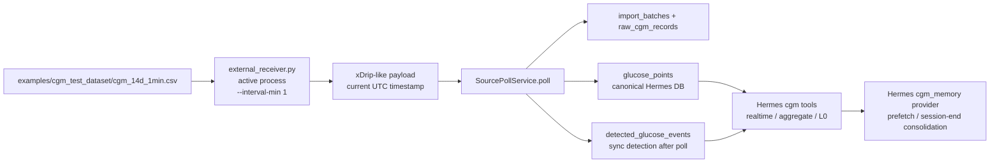

# CGM CSV Simulation Chain Audit - 2026-07-02

## Scope

This note records the current concrete data path for the local CGM simulation.
The target requirement is:

1. Use the provided CSV as the simulated CGM fact source.
2. Emit one CGM reading per minute, like a real current CGM stream.
3. Persist each reading into the local Hermes CGM SQLite database.
4. Let the analytics layer read the database and compute realtime/trend metrics.
5. Feed the computed context/results into Hermes memory handling.

## Current Runtime Snapshot

Observed at approximately `2026-07-02T07:19:39Z`.

- Canonical database: `C:\Users\postgres\AppData\Local\hermes\cgm-agent\app.db`
- Active test identity: `user_id=demo-prediabetes-14d-v2`, `source=virtual:aidex-v2`
- Active installed Hermes tool plugin includes `cgm_timeseries_get_realtime_snapshot`.
- Active installed Hermes memory provider plugin is present as `cgm_memory`.
- Current data stream is writing current UTC timestamps, not stale CSV timestamps.
- DB contained 11 current-run glucose points at the audit snapshot.
- Latest point at audit snapshot: `2026-07-02T07:18:50Z`, `104.4 mg/dL`.
- Realtime snapshot result: `status=ok`, `stale_status=false`, `data_freshness_minutes=0.82`.
- Aggregate over the current two-hour window: `TIR=100.0`, `MBG=105.04`, `CV=0.86`, `point_count=11`.
- L0 context builds successfully from those DB points.
- L1/L2/L3 memory layers for this user are still empty.
- `memory_summaries` is empty.

## Actual Chain In Use



## Stage-By-Stage Status

### 1. Data Simulation

There are multiple simulation implementations in the repo:

- `virtual_cgm_feed.py`: serves CSV rows over HTTP and preserves the CSV timestamps. This is useful for historical replay, but it makes realtime checks stale.
- `auto_poll.py`: repeatedly polls the virtual HTTP feed and writes to the same DB through `SourcePollService`.
- `simulation_tick.py`: one-shot, resumable tick intended for cron-style scheduling. It also preserves the CSV point timestamp unless its source feed is changed.
- `external_receiver.py`: currently running. It reads the CSV and assigns the current UTC timestamp to each emitted point.
- `cgm_receiver.py`: newer standalone receiver with a JSON state file, direct injected client, current UTC timestamps, and notification support.

For the user's actual requirement, the correct conceptual path is the current-timestamp receiver path, not the stale historical replay path.

Current active process command lines show `external_receiver.py --csv examples/cgm_test_dataset/cgm_14d_1min.csv --interval-min 1`.

Important caveat: more than one receiver process is currently present. At audit time, two Python receiver processes and two bash wrapper processes matched the receiver command. This is a runtime risk because multiple processes derive the next CSV index from DB row count and can race.

### 2. Data Ingestion

The receiver hands an xDrip-like payload to `SourcePollService.poll`.

`SourcePollService.poll` does three writes:

- archives the raw payload into `import_batches` and `raw_cgm_records`;
- normalizes and writes a deduped `glucose_points` row;
- runs deterministic glucose event detection over a short lookback window and writes `detected_glucose_events` when an episode qualifies.

The canonical DB resolver is `resolve_database_path()`, which resolves to `<HERMES_HOME>\cgm-agent\app.db`; on this machine that is:

`C:\Users\postgres\AppData\Local\hermes\cgm-agent\app.db`

This is the DB both the local code and installed Hermes plugins are meant to share.

### 3. Analytics

The analytics layer is working against the canonical DB.

Verified Hermes-facing tool behavior:

- `timeseries.get_realtime_snapshot`: reads recent DB points and reports latest glucose, freshness, rolling mean, missing rate, deltas, slope, and stale status.
- `timeseries.get_aggregate`: computes TIR, TAR, TBR, MBG, CV, GMI, LBGI, HBGI, MAGE, MODD, CONGA when enough data exists.
- `context.get_l0`: builds deterministic short-term context from local CGM points, daily aggregates, recent high-resolution points, hourly summaries, detected events, and confirmed user events.

At the audit snapshot, realtime and aggregate were both valid, but coverage was still low because only 11 minutes of current-run data existed.

### 4. Hermes Memory Handling

Hermes has two relevant integration surfaces:

- `cgm` standalone tool plugin exposes CGM tools, including timeseries, reports, context, memory tools, delivery, dexcom sync, and push tick.
- `cgm_memory` exclusive memory provider injects CGM context through `system_prompt_block`, `prefetch`, `sync_turn`, `on_session_end`, and compression hooks.

The memory provider currently reads:

- latest warm `memory_summaries`, if present;
- L0 context from DB points;
- L1 episodes and active L3 hypotheses through memory retrieval.

The important boundary: raw CGM points do not automatically become durable L1/L2/L3 memory on every tick.

Durable memory formation currently requires one of these paths:

- report generation emits memory candidates, followed by memory review/confirmation or auto-ingest where enabled;
- accepted candidates become L1 episodes and can consolidate into L2/L3;
- session end runs consolidation over existing L1 episodes;
- `memory-synthesize` creates warm state summaries from metrics and existing memory;
- `seed-demo` can run a demo-only full data-to-memory chain.

Current state for `demo-prediabetes-14d-v2`: L1/L2/L3 and warm summaries are empty, so the data is available to Hermes as realtime/L0 context, but not yet as long-term learned memory.

## Main Risks

1. Multiple receiver processes are active.
   This can race on DB-count-derived CSV index selection. It has not obviously doubled the latest rows yet, but it is not a clean single-writer setup.

2. `external_receiver.py` is active but rougher than `cgm_receiver.py`.
   It uses DB row count as state, has mojibake text in the file, and contains a hardcoded mojibake project-root fallback. It is nevertheless writing successfully in the current environment.

3. Current durable memory is empty.
   Hermes can answer from realtime/L0 tools, but long/short-term memory handling has not yet proven automatic CGM-to-L1/L2/L3 formation for this run.

4. Event detection may stay empty until meaningful hypo/hyper/rapid-change windows appear.
   A `detected_event_count=0` result can mean "no event yet", not necessarily a broken detector.

5. Realtime expected interval must match the simulation.
   The current receiver emits every 1 minute, so validation should call realtime/aggregate with `expected_interval_minutes=1`. Older docs and feed scripts default to 5 minutes.

## Recommended Canonical Chain For This Test

Use one single current-time receiver process:

```powershell
cd "E:\字幕组测试\CGM-Agent\hermes-cgm-agent-latest"
python examples\cgm_test_dataset\cgm_receiver.py `
  --csv examples\cgm_test_dataset\cgm_14d_1min.csv `
  --emit-interval-min 1 `
  --expected-interval-min 1 `
  --user-id demo-prediabetes-14d-v2 `
  --source virtual:aidex-v2
```

Then validate through Hermes-facing tools:

1. `cgm_timeseries_get_realtime_snapshot` with `expected_interval_minutes=1`, expecting `stale_status=false`.
2. `cgm_timeseries_get_aggregate` over the current run window.
3. `cgm_context_get_l0` for `demo-prediabetes-14d-v2`.
4. Generate a daily/self report after enough data exists.
5. Use `memory-synthesize` or report memory ingestion if the goal is to exercise warm/L1/L2/L3 memory, not just realtime context.
6. Use `cgm_memory_list` to confirm durable memory formation.

## Bottom Line

The CSV-to-DB-to-analytics-to-Hermes-tool chain is currently working for current-time simulated CGM data.

The chain is not yet cleanly single-writer, because duplicate receiver processes are active.

The chain has not yet proven automatic long-term memory formation. Hermes can read the current CGM state via realtime/L0 context, but L1/L2/L3 and warm summaries remain empty for the active test user.
